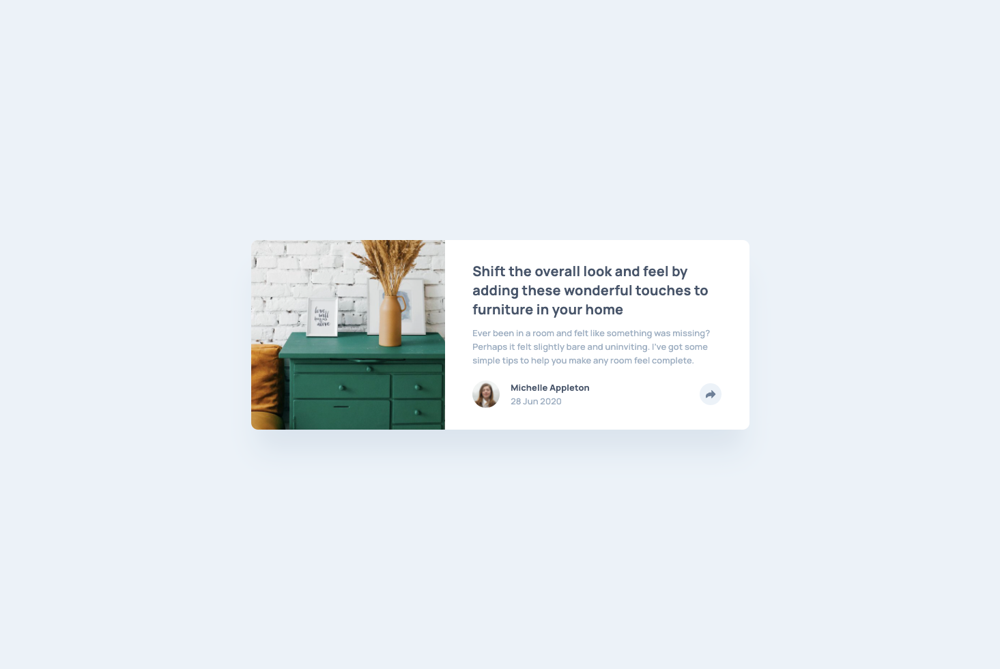

# Frontend Mentor - Article preview component solution

This is a solution to the [Article preview component challenge on Frontend Mentor](https://www.frontendmentor.io/challenges/article-preview-component-dYBN_pYFT).

## Table of contents

- [Overview](#overview)
  - [The challenge](#the-challenge)
  - [Screenshot](#screenshot)
  - [Links](#links)
- [My process](#my-process)
  - [Built with](#built-with)
  - [What I learned](#what-i-learned)
  - [Useful resources](#useful-resources)
- [Author](#author)

## Overview

### The challenge

Users should be able to:

- View the optimal layout for the component depending on their device's screen size
- See the social media share links when they click the share icon

### Screenshot



### Links

- Solution URL: [https://github.com/Blondeli/article-preview-component](https://github.com/Blondeli/article-preview-component)
- Live Site URL: [https://blondeli.github.io/article-preview-component/](https://blondeli.github.io/article-preview-component/)

## My process

### Built with

- Semantic HTML5 markup
- CSS custom properties
- Flexbox
- Mobile-first workflow
- Javascript

### What I learned

- For this challenge, I had to figure out how to set an image size relative to its parent container's height. For the desktop design, I wanted the image to automatically resize, so that its height would be equal to its parent container's while maintaining its original ratio. I found the following solution:

```html
<div class="img-wrap">
  
</div>
```

```css
.img-wrap {
  width: 200px;
  height: 150px;
  position: relative;
  overflow: hidden;
}

div > img {
  display: block;
  position: absolute;
  top: 50%;
  left: 50%;
  min-height: 100%;
  min-width: 100%;
  transform: translate(-50%, -50%);
}
```

- I learned how to change CSS properties using Javascript:

```js
let popup = document.getElementsByClassName("mobile-popup");
popup[0].style.display = "block";
```

- I learned how to get the value of a CSS property using Javascript:

```js
let popup = document.getElementsByClassName("desktop-popup");
window.getComputedStyle(popup[0]).getPropertyValue("display");
```

### Useful resources

- [CSS: How can I set image size relative to parent height?](https://stackoverflow.com/questions/19192892/css-how-can-i-set-image-size-relative-to-parent-height) - This question on Stack Overflow helped me to figure out how to resize an image relative to its parent's height.

## Author

- Frontend Mentor - [@Blondeli](https://www.frontendmentor.io/profile/blondeli)
- LinkedIn - [Elisabeth Martin](https://www.linkedin.com/in/elisabeth-martin-873773199/)
